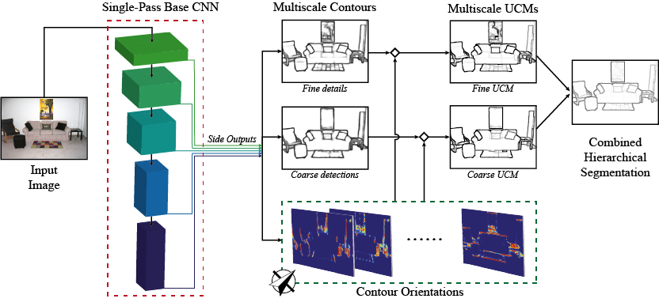

# Convolutional Oriented Boundaries (COB) : Perceptual Grouping Beyond the BSDS
This is the Convolutional Oriented Boundaries (COB) implementation. COB is a technique that produces multiscale oriented contours and region hierarchies, starting from generic image classification CNNs. COB is computationally efficient, because it requires a single CNN forward pass for multiscale contour detection and uses a novel sparse boundary representation for hierarchical segmentation; it gives a significant leap in performance over the state-of-the-art and it generalizes very well to unseen categories and datasets. Particularly, we show that learning to estimate not only contour strength but also contour orientation provides more accurate results. We also conclude that our architectures do not require contour globalization, which was one of the speed bottlenecks in existing approaches. The whole pipeline runs in the order of 0.8 seconds per image to produce state-of-the-art hierarchical boundaries.

### Prerequisites:
 - Install [this](https://github.com/s9xie/hed) version of Caffe along with standard dependencies and matcaffe.
 - The CNN models of COB to reproduce the results of this paper are available. Download them and put them under models/:
  1. Model trained on PASCALContext train set (VOC train) [Link](https://data.vision.ee.ethz.ch/kmaninis/share/COB/Downloads/COB_PASCALContext_train.zip).
  2. Model trained on PASCALContext trainval set (VOC train + VOC val) [Link](https://data.vision.ee.ethz.ch/kmaninis/share/COB/Downloads/COB_PASCALContext_trainval.zip).
  3. Model trained on BSDS500 trainval set [Link](https://data.vision.ee.ethz.ch/kmaninis/share/COB/Downloads/COB_BSDS500.zip).

### COB Usage
- To compute COB UCMs, see im2ucm.m (and scripts/im2cob_all.m)
- To compute COB proposals, see im2prop.m (and scripts/im2cob_all.m)
- For demos about how to use these functions, see the 'demos' folder

For more information on how to use the code, please read README.txt
 
### Citations:
If you use this code, please consider citing the following paper:

	@Inproceedings{Man+16a,
	  Title          = {Convolutional Oriented Boundaries},
	  Author         = {K.K. Maninis and J. Pont-Tuset and P. Arbel\'{a}ez and L. Van Gool},
	  Booktitle      = {European Conference on Computer Vision (ECCV)},
	  Year           = {2016}
	}

If you encounter any problems with the code, please contact the first author.
For pre-computed results on BSDS500, PASCAL, SBD, and COCO, as well as additional information, please visit our [project page](http://www.vision.ee.ethz.ch/~cvlsegmentation).

Enjoy!